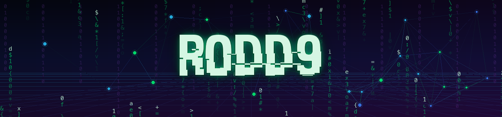

<!--
  Profile README для github.com/roddg86  (репозиторий: roddg86/roddg86)
  Единый неоновый стиль: green #00FF78 · cyan #28C8FF · dark #06080F
  Динамика: Pacman (ветка output) — генерируется GitHub Action в .github/workflows/.
-->

<!-- ── ШАПКА: свой баннер ── -->
<div align="center">
  
</div>

<div align="center">

<h1>
  Привет, я r0dd9
  
</h1>

<a href="https://git.io/typing-svg">
  
</a>

<br/><br/>


&nbsp;

&nbsp;
<a href="https://hackerlab.pro/users/r0dd9">
  
</a>

</div>


##  Обо мне

```python
class Pentester:
    def __init__(self):
        self.alias    = "r0dd9"
        self.role     = "пентестер"
        self.focus    = ["веб-безопасность", "инструменты на Python", "поиск уязвимостей"]
        self.learning = "Python · наступательная безопасность"

    def daily(self):
        return "разведка → эксплуатация → отчёт → повтор"
```

```console
r0dd9@matrix:~$ whoami
> пентестер — ломаю, чтобы сделать безопаснее
r0dd9@matrix:~$ cat ./focus.txt
> веб-безопасность · наступательный Python · поиск уязвимостей
r0dd9@matrix:~$ ./stats --labs
> HackerLab.pro — лабы и CTF-практика
```

- 🛡️ &nbsp;Пентестер с фокусом на **безопасности веб-приложений**
- 🐍 &nbsp;Пишу наступательные инструменты и автоматизацию на **Python**
- 🔎 &nbsp;Интересуюсь поиском и ответственным раскрытием **уязвимостей**
- 🧪 &nbsp;Практикуюсь на **[HackerLab.pro](https://hackerlab.pro/users/r0dd9)** — лабы и CTF
- 🤝 &nbsp;Открыт к сотрудничеству в security-исследованиях и CTF


##  Арсенал и инструменты

### Языки и база


### Пентест и безопасность


### Окружение


##  Статистика GitHub

<div align="center">


<br/>


<br/>


</div>


##  Активность

[](https://github.com/roddg86)

###  Pac-Man поедает мои контрибуции

<div align="center">
  <picture>
    <source media="(prefers-color-scheme: dark)" srcset="https://raw.githubusercontent.com/roddg86/roddg86/output/pacman-contribution-graph-dark.svg">
    <source media="(prefers-color-scheme: light)" srcset="https://raw.githubusercontent.com/roddg86/roddg86/output/pacman-contribution-graph.svg">
    
  </picture>
</div>


##  Цитата дня

<div align="center">
  
</div>


##  Связаться со мной

<div align="center">

[](https://roddg86.github.io)
[](https://t.me/arthorre)
[](https://hackerlab.pro/users/r0dd9)

</div>


<!---
roddg86/roddg86 — ✨ особый ✨ репозиторий: его README.md показывается в твоём профиле GitHub.
--->
